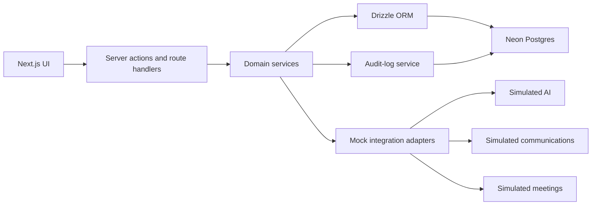

# Symph CRM POC Design

Date: 2026-07-20  
Status: Approved design, ready for implementation planning

## 1. Objective

Create a high-fidelity, interactive proof of concept based on the captured Symph CRM pages. The POC must reproduce every main route, connect the primary CRM workflows, support role switching, persist demo data in Neon Postgres, and deploy to Vercel.

The POC is a realistic product demonstration, not a production CRM. Integrations with AI, email, calendars, messaging platforms, uploads, and recordings are simulated. The application must never contact real customers or external communication channels.

## 2. Success Criteria

- Every captured main route exists and closely matches the reference screenshots.
- The application supports Account Manager, Sales, and Admin demo personas.
- The lead-to-deal-to-revenue workflow works end to end.
- Important filters, searches, sorts, tabs, dialogs, board interactions, and status changes work.
- Every data mutation produces an audit-log entry.
- External integrations behave convincingly but remain simulated.
- Seeded data is fictional and can be restored to a deterministic baseline.
- The deployed demo runs on Vercel and uses a free Neon database provisioned through the Vercel Marketplace.

## 3. Approved Technical Architecture

### Application

- Next.js App Router
- TypeScript
- Tailwind CSS
- Accessible reusable UI primitives for dialogs, menus, tabs, tables, tooltips, inputs, badges, and toasts
- Server Components for initial reads
- Server Actions or focused route handlers for mutations

### Database

- Neon Serverless Postgres
- Neon provisioned through the native Vercel Marketplace integration
- Drizzle ORM for type-safe queries and schema declarations
- Drizzle Kit for SQL migrations
- Neon serverless driver for application queries
- Deterministic seed and reset scripts

The Neon free plan is suitable for an intermittent POC workload. The design assumes a single project, a compact fictional dataset, scale-to-zero when idle, and no large binary storage in Postgres.

### Deployment

- Vercel preview deployments during development
- One production Vercel deployment for stakeholder demonstrations
- `DATABASE_URL` supplied through the Neon/Vercel integration
- Schema migration and seed steps executed explicitly before demo acceptance

### External-service boundary

All external features use typed adapters with mock implementations:

- Symph AI
- Gmail
- Google Calendar
- Messenger
- Instagram
- WhatsApp
- Viber
- Currency-rate feed
- Proposal uploads
- Meeting recordings and transcripts

Mock adapters must introduce short, deterministic delays and support controlled success and failure fixtures. Replacing a mock adapter with a real integration later must not require changing domain or UI components.

## 4. Application Structure

The application is divided into four domains with shared infrastructure.

### Shared shell

- Grouped, collapsible sidebar
- Global command palette labeled “Jump to”
- Dark and light themes, with dark as the default
- Account menu and active persona display
- Persona switcher for Account Manager, Sales, and Admin
- Notifications, toasts, loading skeletons, empty states, and error states
- Shared search, filtering, sorting, table, pagination, dialog, and badge patterns
- Visible Demo indicator when a feature uses simulated data or integrations

### Core CRM

#### Dashboard (`/`)

- Lifetime, month, year, and display-currency controls
- Summary KPI cards
- Pipeline progress by stage
- Top-deals panel
- Account Manager leaderboard
- Recent activity feed
- Values recomputed from Neon data after demo mutations

#### Chat (`/chat`)

- Conversation list and new-chat action
- Prompt composer
- Simulated Symph AI responses
- Pipeline-summary shortcut
- Log-call shortcut
- Create-deal shortcut
- Draft-email shortcut
- No request leaves the application

#### Leads (`/leads`)

- Active, followed-up, and converted counters
- Name, company, contact, industry, and segment search
- Segment filters
- Status filter
- Sortable lead table
- Create and edit lead dialogs
- Archive action
- Convert-to-deal workflow

#### Deals (`/deals`)

- Owner and Product/Service/Reseller filters
- Search
- Board, list, and heatmap views
- Pipeline stages: Lead, Discovery, Assessment, Demo + Proposal, Follow-up, Parked, Won, and Lost
- Stage movement with optimistic feedback and server confirmation
- Deal detail view with value, owner, brand, catalog classification, activities, notes, and attachment metadata

#### Brands (`/brands`)

- Searchable and sortable organization table
- Industry, pipeline value, deal count, last activity, and creator
- Brand detail workspace
- Related deals, conversations, proposals, notes, and files

#### Wiki (`/wiki`)

- Brand and deal explorer
- Expandable hierarchy
- Unified search across brands, deals, notes, and files
- Selected-record detail workspace

### Engagement

#### Inbox (`/inbox`)

- Channel tabs for all, email, Messenger, Instagram, WhatsApp, and Viber
- All/unread filter
- Conversation search
- Compose flow
- Conversation detail and simulated thread history
- Google connection prompt represented as a demo connection state
- Sending produces a local simulated message only

#### Meetings (`/meetings`)

- Meetings and Recordings tabs
- All, Pending, Done, and Failed filters
- Search
- Meeting details and notes
- Transcript and recording fixtures

#### Proposals (`/proposals`)

- Presentation and Formal types
- All, Draft, Sent, and Signed filters
- Search by proposal, brand, and deal
- Simulated upload
- Preview
- Draft-to-sent-to-signed status lifecycle

#### Partnerships (`/users`)

- Restricted to Sales and Admin personas
- Pending and approved external CRM accounts
- Partnership groups
- Group creation and membership management
- Permission-denied state for Account Manager

### Business

#### Revenue (`/revenue`)

- All, Products, Services, and Reseller filters
- Monthly target, project revenue, startup MRR, existing-client revenue, and surplus KPIs
- Revenue-versus-target progress
- Project-based revenue grid
- Startup recurring-revenue grid
- Existing-client recurring-revenue grid
- Monthly columns
- Add and edit revenue entries

#### Bills (`/bills`)

- Won-deal billing configurations
- Monthly and milestone billing types
- Deal, company, value, monthly amount, period, and milestone progress
- Create and edit billing setup
- Soft-delete billing setup

#### Catalog (`/catalog`)

- All, Products, Services, and Resellers filters
- Sortable catalog table
- Name, landing page, status, and creation date
- Preview, edit, and archive actions

### System

#### Audit Logs (`/audit-logs`)

- Search
- Entity, action, and user filters
- Sortable event history
- Pagination
- Detailed before/after change view
- Automatic entries for every demo mutation

#### Settings (`/settings`)

- Active persona profile
- Deal Trash entry
- Integration connection cards
- Simulated Google connection state
- Viber, WhatsApp, and Messenger coming-soon states

#### Deal Trash (`/settings/trash`)

- Soft-deleted deals
- Restore action
- Permanent-delete confirmation
- Admin-only permanent deletion

## 5. Role Model

| Capability | Account Manager | Sales | Admin |
|---|---:|---:|---:|
| Dashboard and Chat | Yes | Yes | Yes |
| Leads and Deals | Assigned/owned records | All sales records | All records |
| Brands and Wiki | Yes | Yes | Yes |
| Inbox and Meetings | Yes | Yes | Yes |
| Proposals | Assigned/owned records | All sales records | All records |
| Partnerships | No | Yes | Yes |
| Revenue and Bills | Read and assigned updates | Yes | Yes |
| Catalog editing | No | No | Yes |
| Audit Logs | Own events | Sales events | All events |
| Integrations and Deal Trash | No permanent delete | No permanent delete | Full access |

The persona switcher is demo authentication. It changes the active user and role in a signed, server-readable demo session. It is not a production identity system.

## 6. Data Model

Primary tables:

- `users`
- `roles`
- `user_roles`
- `leads`
- `brands`
- `deals`
- `deal_stage_history`
- `activities`
- `notes`
- `attachments`
- `communication_channels`
- `conversations`
- `messages`
- `meetings`
- `recordings`
- `proposals`
- `proposal_versions`
- `partnership_accounts`
- `partnership_groups`
- `partnership_group_members`
- `catalog_items`
- `revenue_targets`
- `revenue_entries`
- `billing_plans`
- `billing_milestones`
- `integration_connections`
- `audit_logs`

### Key relationships

- A lead can be converted into a brand and deal.
- A brand owns many deals, conversations, proposals, notes, and attachments.
- A deal belongs to a brand and owner, references a catalog classification, and has stage history.
- Won deals can own revenue entries and billing plans.
- Billing plans can own milestone records.
- Conversations own messages and identify a simulated communication channel.
- Proposals belong to brands and deals and can have version history.
- Audit logs identify actor, entity, action, previous value, new value, and timestamp.

### Record lifecycle

- Mutable domain records include creation and update timestamps.
- Deletable records use `deleted_at` for soft deletion.
- Deal Trash displays only soft-deleted deals.
- Permanent deletion is an explicit Admin-only action.
- Reset removes demo mutations and reruns the deterministic seed.

## 7. Application Data Flow

- Initial page reads are server-rendered.
- Shareable filters use URL query parameters where practical.
- Validated server actions perform mutations.
- Domain services own business rules and do not depend on UI components.
- Mock integration adapters return typed fixtures.
- The audit service records successful mutations in the same domain operation.
- Optimistic UI is limited to reversible status and stage changes.

## 8. Primary End-to-End Scenario

1. Select the Account Manager persona.
2. Create a fictional lead.
3. Qualify and convert the lead into a brand and deal.
4. Move the deal through pipeline stages.
5. Add an activity, note, and simulated proposal.
6. Switch to Sales and review the proposal and partnership surfaces.
7. Mark the deal Won.
8. Add revenue and billing configuration.
9. Review updated dashboard and revenue totals.
10. Switch to Admin and inspect Audit Logs.
11. Archive the deal, restore it from Deal Trash, then demonstrate permanent deletion on disposable seeded data.
12. Reset the database to the baseline seed.

Secondary demonstrations cover AI chat, compose-message simulation, meeting fixtures, filters, sorting, search, empty states, and permission-denied states.

## 9. Validation, Errors, and Safeguards

- Validate all server-action inputs.
- Show field-level validation messages.
- Disable submissions while requests are in progress.
- Use loading skeletons for Neon cold starts and slower queries.
- Show retryable toasts for database and network failures.
- Provide empty states for zero-result filters and new datasets.
- Provide permission-denied states for restricted personas.
- Provide not-found states for missing records.
- Require confirmation for archive, restore, and permanent deletion.
- Label all simulated integration actions as Demo.
- Use only fictional seeded identities, organizations, communications, and financial data.
- Store attachment metadata and fixture references only; do not place large files in Neon.

## 10. Testing Strategy

### Unit tests

- Validation schemas
- Permission rules
- Deal-stage transitions
- Lead conversion
- Dashboard and revenue calculations
- Billing calculations
- Audit event creation

### Integration tests

- Drizzle repositories against a separate Neon test branch or isolated test schema
- Migrations from an empty database
- Deterministic seed and reset
- Multi-table lead conversion transaction
- Soft deletion, restoration, and permanent deletion

### End-to-end tests

- Persona switching and role restrictions
- Lead-to-revenue primary scenario
- Board/list/heatmap view switching
- Inbox and meeting simulations
- Proposal lifecycle
- Catalog administration
- Audit log filtering and detail
- Deal Trash behavior

### Visual and deployment verification

- Screenshot comparison against the captured reference pages
- Desktop presentation viewport verification
- Vercel preview smoke test after each major phase
- Production smoke test after promotion

## 11. Delivery Plan

Estimated effort for one experienced full-stack developer: 15 working days.

| Phase | Duration | Deliverables |
|---|---:|---|
| Foundation | 2 days | Next.js project, shared CRM shell, role switcher, Vercel project, free Neon integration |
| Database | 2 days | Drizzle schema, migrations, repositories, seed/reset, audit service |
| Core CRM | 4 days | Dashboard, Chat, Leads, Deals, Brands, Wiki, lead conversion |
| Engagement | 2 days | Inbox, Meetings, Proposals, Partnerships, mock adapters |
| Business and System | 3 days | Revenue, Bills, Catalog, Audit Logs, Settings, Deal Trash |
| Polish and Deployment | 2 days | Visual matching, edge states, automated tests, production Vercel deployment |

## 12. Out of Scope

- Real Google, email, calendar, social, or messaging credentials
- Sending real messages or invitations
- Real AI model calls
- Production authentication, password recovery, MFA, or SSO
- Production-grade row-level security or compliance controls
- Importing confidential data from the source CRM
- Large-file storage or media processing
- Native mobile applications
- Billing or payment processing
- Production monitoring, incident response, or formal disaster recovery

## 13. Reference Material

- Captured pages: `crm-symph-audit/screenshots/`
- Neon on Vercel: https://vercel.com/marketplace/neon
- Neon pricing: https://neon.com/pricing
- Drizzle overview: https://orm.drizzle.team/docs/overview
- Drizzle with Neon: https://orm.drizzle.team/docs/connect-neon

